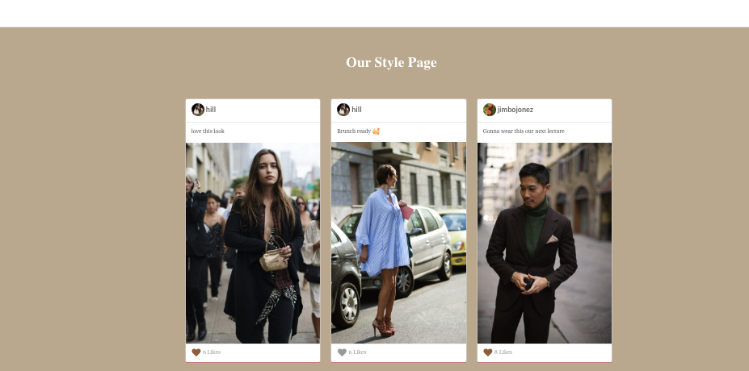

#   Capitol Hill

##  Introduction:
Many pieces of clothing are invented for a vital purpose before they become fashionable, but as they become representative of a lifestyle or an aesthetic, they must first represent a meaning. Fashion allows us to create and establish ourselves, molding our identity as individuals while imaginably maintaining an artistic expression. Fashion repeatedly sparks the desire to be different enough to stand out but similar enough to belong to the group or culture our clothing helps identify. 

##  Purpose of Capitol Hill: 
A visual platform enabling users to share images with others who see themselves as visual storytellers.

###  Screenshots: 

##  Technologies Used:
-   HTML5
-   CSS
-   JavaScript
-   React.JS
-   Node.JS
-   Express.JS
-   MongoDB
-   Mongoose
-   Semantic UI framework

##  Getting started:
[Visit Capitol Hill](https://capitolhill.herokuapp.com/)

[Trello](https://trello.com/b/Tvix4qmM/p4-capitol-hill)

[Wireframe](https://whimsical.com/capitolhill-Cos6osLFiRUbDEsJXRzPiP)

###  Minimum Viable Product (MVP):
-   As a user, I want to view eye-catching and trendy items that popular in 2022 in the community. 
-   As a user, I want to like posts made my people on this application. 
-   As a user, I want to unlike posts made my people on this application.
-   As a user, I want delete posts.
-   As a user, I want to create and post creative content.

### Next Steps:
-   Allowing users to update their posts within the feedpage.
-   Creating a comment section on the feed.
-   Incorporating a favorite's section for users.